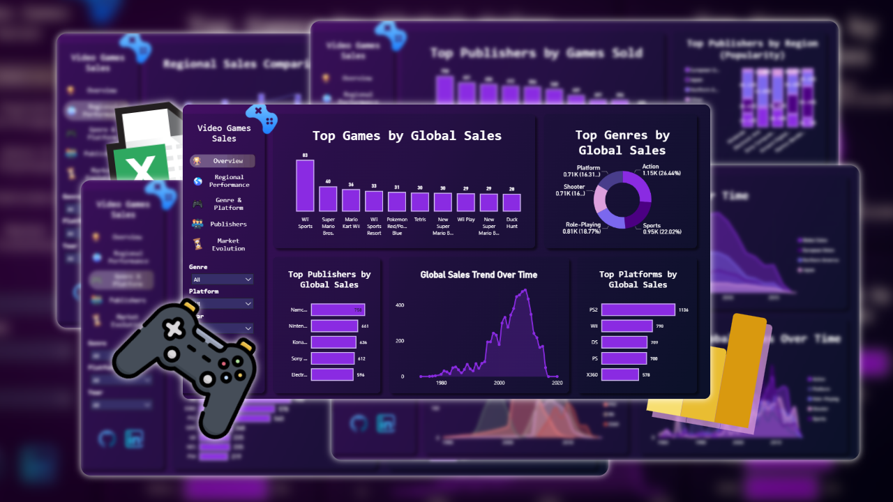
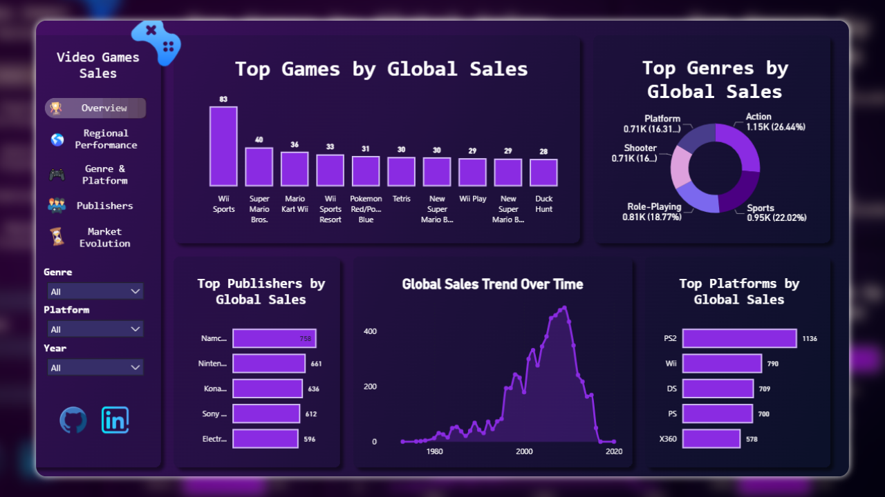
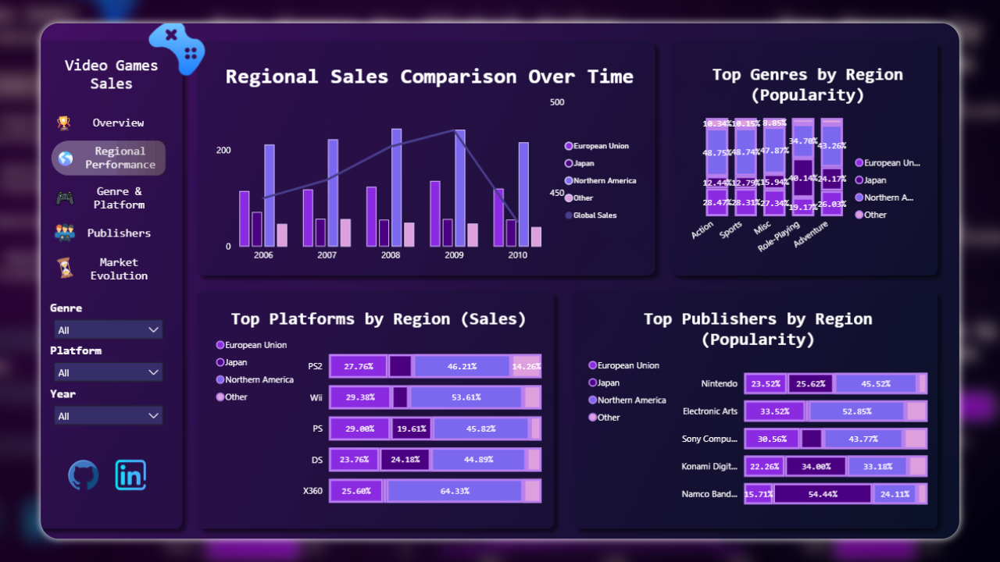
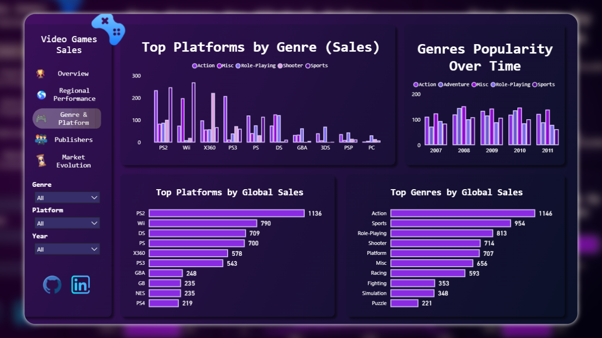
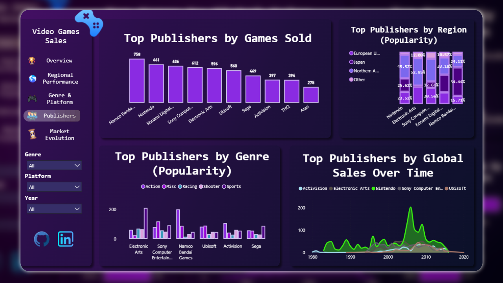
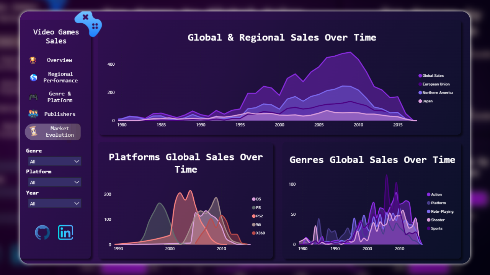

# Video Game Sales Analysis Dashboard

This repository contains a comprehensive Power BI dashboard for analyzing global video game sales. The project visualizes historical data to uncover trends in sales, platform popularity, genre preferences, and publisher performance.

The dashboard features a custom UI designed entirely in **Figma** to create a clean, modern, and intuitive user experience.

---

## 🚀 Project Goal

The primary goal of this project was to:
1.  **Analyze Data:** Process and model video game sales data to extract meaningful insights.
2.  **Visualize Trends:** Create compelling and interactive visualizations that tell a story about the gaming industry's evolution.
3.  **Custom Design:** Move beyond default Power BI templates by designing a complete, professional UI in Figma and implementing it.

## 🛠️ Tools Used

* **Power BI:** Used for data modeling, DAX calculations, and building the interactive dashboard.
* **Figma:** Used for the complete UI design, including layout, color palette, and component creation.
* **Excel:** Used as the data source for the analysis.

## 📊 Dashboard Breakdown

The report is divided into five main pages, each focusing on a different aspect of the data:

### 1. Overview

A high-level summary of the entire dataset, featuring:
* **Top Games, Platforms, and Publishers** by global sales.
* **Global Sales Trend Over Time** showing the market's peak.
* **Top Genres by Global Sales** (Action, Sports, Platform, etc.).

### 2. Regional Performance

A deep dive into sales and popularity across different regions (North America, European Union, Japan, and Other).
* **Regional Sales Comparison** over time.
* **Top Genres, Platforms, and Publishers** broken down by region.

### 3. Genre & Platform

Analyzes the relationship and performance of different genres and gaming platforms.
* **Top Platforms by Genre** (e.g., which platforms sold the most Action games).
* **Top Platforms & Genres** by global sales.
* **Genre Popularity Over Time**.

### 4. Publishers

Focuses on the performance of video game publishers.
* **Top Publishers by Games Sold** and global sales.
* **Publisher Sales Over Time**.
* **Publisher Popularity** by region and genre.

### 5. Market Evolution

Provides a historical view of the video game market's growth and changes.
* **Global & Regional Sales Over Time** (1980 - ~2016).
* **Platform Global Sales Over Time**, showing the rise and fall of console generations (PS2, Wii, DS, etc.).
* **Genre Global Sales Over Time**, illustrating how genre preferences have shifted.

## 💡 Key Insights from the Analysis

* **Market Peak:** The video game market saw a significant peak in global sales around **2008-2009**, driven by the success of the Nintendo Wii and DS.
* **Top Performers:** The **PlayStation 2 (PS2)** stands as the all-time top-selling platform, while **"Wii Sports"** is the top-selling game (likely due to being bundled with the console).
* **Dominant Genres:** **Action** and **Sports** are consistently the highest-grossing genres globally.
* **Regional Differences:** Clear regional preferences are visible; for example, **Nintendo** shows exceptionally strong popularity in Japan compared to other regions.

---

## Connect With Me
Thank you for reviewing my project. I am open to any feedback or discussions regarding this analysis, data visualization, or other opportunities.

Feel free to connect with me on LinkedIn!

